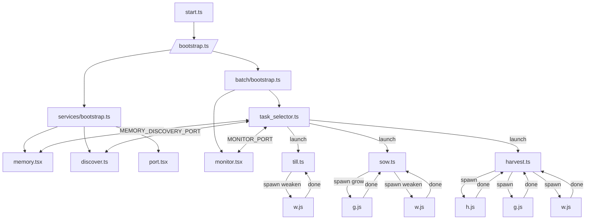

# Batch System Overview

The batch hacking system is composed of a set of long running services and batch scripts.  The flowchart below shows how the main scripts are launched and how they communicate with each other.

Scripts communicate over dedicated ports.  Memory allocations use `MEMORY_PORT`/`MEMORY_RESPONSE_PORT`, port requests use `PORT_ALLOCATOR_PORT`/`PORT_ALLOCATOR_RESPONSE_PORT` and task lifecycle updates flow through `TASK_SELECTOR_PORT` and `MONITOR_PORT`.
