# Harvest Batch Timing

The harvest script schedules four phases so that each one ends `CONFIG.batchInterval` milliseconds after the previous.  The diagram below illustrates the relative timing of these phases.  Durations depend on the target server but the end times are evenly spaced.

```mermaid
gantt
title Harvest Batch Phases
dateFormat s
axisFormat %S s

section Batch1
Hack                 :hack, 15, 20
Weaken after Hack    :w1, 1, 21
Grow                 :grow, 6, 22
Weaken after Grow    :w2, 3, 23

section Batch2
Hack                 :hack, 19, 24
Weaken after Hack    :w1, 5, 25
Grow                 :grow, 10, 26
Weaken after Grow    :w2, 7, 27

section Batch3
Hack                 :hack, 23, 28
Weaken after Hack    :w1, 9, 29
Grow                 :grow, 14, 30
Weaken after Grow    :w2, 11, 31
```

Each phase runs on a worker host and writes a done message to a port when complete.  The harvester waits for each phase to finish before launching the next batch.
